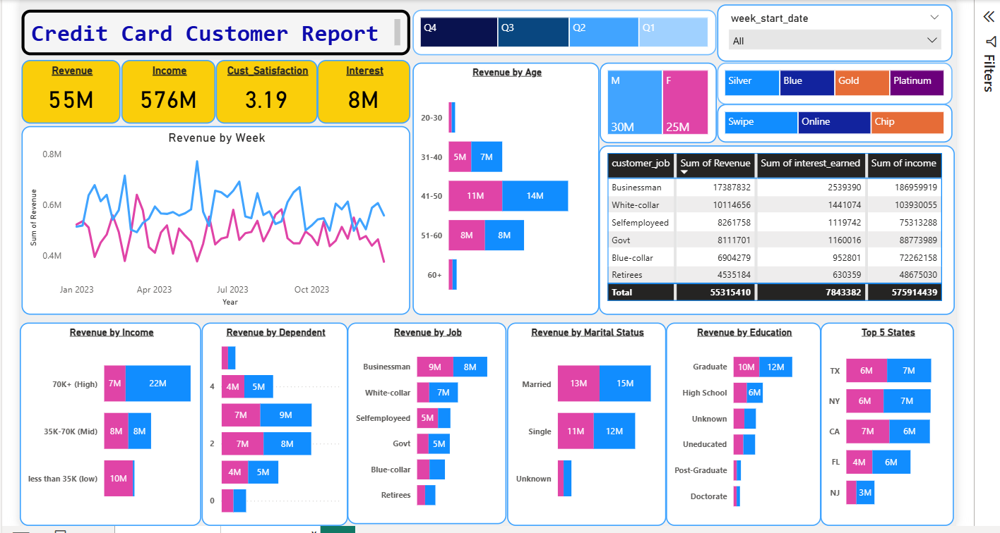
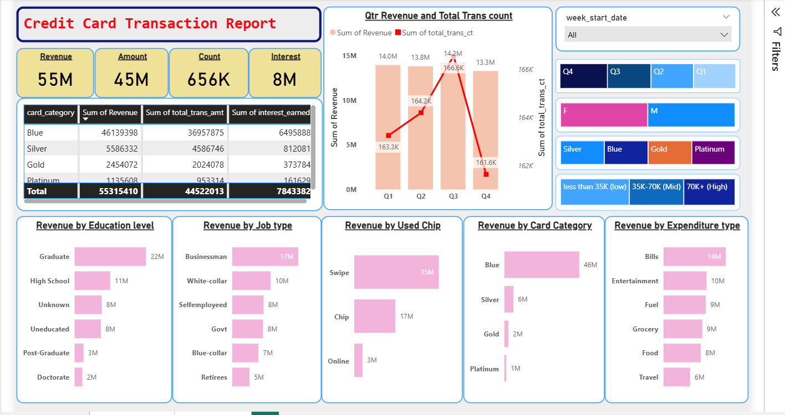

# **Credit Card Analytics Report (Power BI)**  

## **Overview**  
This project is a **business-focused credit card analytics solution** built by **Ayush Srivastava** to analyze customer behavior and transaction patterns using Power BI.  

The dashboards are designed to help financial institutions, startups, and SMEs gain **clear visibility into revenue drivers, customer segments, and spending trends**, enabling faster and more informed decision-making.  

---

## **Objective**  
- Identify **high-value customers** and key revenue-generating segments  
- Analyze **spending behavior and transaction trends** across time  
- Support business decisions related to **customer targeting, product optimization, and risk monitoring**

---

## **Reports Included**  

### Repository Structure
- `reports/` – Power BI dashboard exports and visual report previews  
- `powerbi/` – Power BI (.pbix) dashboard files  
- `data/` – raw and processed datasets used for analysis  
- `docs/` – business context, Readme, and documentation  
```

````
### **1. CC-Customer-Report**


Focuses on *who the customers are* and *where revenue comes from*:

* Revenue by age, income, job type, education, and marital status
* Customer segmentation by card category and geography
* Insights into high-performing customer demographics

### **2. CC-Transaction-Report**

Focuses on *how customers spend* and *how revenue is generated*:

* Transaction volume and revenue trends by quarter
* Card category performance and payment method usage
* Spending patterns across expenditure types

---

## **Skills and Tools Used**

* **Skills**:

  * Data modeling & relationships
  * DAX calculations
  * Filters & slicers
  * Business-focused data visualization

* **Tools**:

  * Power BI

---

## **Key Insights**

* Clear identification of **top-performing card categories**
* Strong correlation between **income levels and spending behavior**
* Seasonal trends in transaction volume and revenue
* High-spend customer segments suitable for targeted campaigns

---

## **Dataset Details**

* **Source**: Credit card transaction data
* **Contents**:

  * Customer attributes (age, income, job type, education, region)
  * Transaction records (amount, category, payment mode, date)

---

## **Key Steps Performed**

1. Modeled relationships between customer and transaction tables
2. Created DAX measures for revenue, interest, and transaction metrics
3. Designed interactive dashboards focused on business questions
4. Applied filters to enable dynamic analysis by time and segment

---

## **Business Value**

These dashboards convert raw credit card data into **actionable business intelligence** by:

* Improving customer segmentation and targeting
* Supporting data-backed marketing and product strategies
* Enhancing visibility into transaction behavior and revenue streams
* Reducing reliance on intuition-driven decisions

---

## **Author**

This project was designed as a **real-world, decision-driven analytics case study**, focusing on how businesses actually use dashboards—not just how they look.

<p align="center">
  <b>Built by Ayush Srivastava (Data Analyst)</b><br>
  ayushwww4@email.com &nbsp;|&nbsp;
  🔗 <a href="https://www.linkedin.com/in/ayush-srivastava-2b6904262/">LinkedIn</a>
</p>


---
